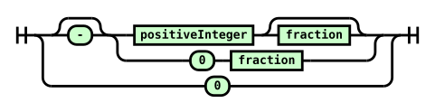

# BNF In Haskell

[Backus-Naur form](https://en.wikipedia.org/wiki/Backus%E2%80%93Naur_form) is technique for describing context-free grammars.

The difference in clarity between specifications using BNF and ones using informal English is enormous. The following [EBNF](https://en.wikipedia.org/wiki/Extended_Backus%E2%80%93Naur_form<Paste>) is unlikely to translate to brief English:
```
number ::= minus? (positive-integer fraction? | zero fraction)
         | zero
```

And even if it was short it wouldn't let you generate this for free:



The above diagram was made with [this webapp](http://www.bottlecaps.de/rr/ui). Unfortunately there's not a native program that generates nice, separate diagrams from BNF files.

I think Haskell would be a natural fit for this kind of work, and so did a survey of the ecosystem to see what's been built so far.

Here are my goals:

#### 1. Validation executable

Simply make sure a BNF file is valid.

ABNF: None yet. (Perhaps build wrapper around the abnf library?)

EBNF: None yet. Ebnf2ps could do this, but it would also try to generate diagrams.

#### 2. Haskell representation

A clean, general Haskell data type that can be used by other libraries.

ABNF: Not sure (investigate the abnf library).

EBNF: None yet.

#### 3. Railroad diagram generator

It should generate separate diagrams for each syntax rule. It should support SVG.

ABNF: None yet.

EBNF: Ebnf2ps is the closest we have, though it doesn't fit the extra requirements.

## Existing Packages

### abnf

[Hackage](http://hackage.haskell.org/package/abnf) / [Source](https://github.com/Xandaros/abnf)

Supported: ABNF

Summary: "Parse ABNF and generate parsers for the specified document"

### Ebnf2ps

[Hackage](http://hackage.haskell.org/package/Ebnf2ps) / [Source](https://github.com/FranklinChen/Ebnf2ps)

Supported: EBNF

Summary: "Generate PostScript diagrams from an EBNF grammar"

### BNFC

[Hackage](http://hackage.haskell.org/package/BNFC) / [Source](https://github.com/BNFC/bnfc)

Supported: Labelled BNF

Summary: "Given a Labelled BNF grammar the tool produces: an abstract syntax as a HaskellC++C module or Java directory, a case skeleton for the abstract syntax in the same language, an Alex, JLex, or Flex lexer generator file, a Happy, CUP, or Bison parser generator file, a pretty-printer as a HaskellJavaC++/C module, a Latex file containing a readable specification of the language."

### BNFC-meta

[Hackage](http://hackage.haskell.org/package/BNFC-meta)

Supported: Labelled BNF

Summary: Embed LBNF within Haskell using Template Haskell

### ebnf-bff

[Hackage](http://hackage.haskell.org/package/ebnf-bff) / [Source](https://github.com/Lokidottir/ebnf-bff)

Supported: EBNF

Summary: "A library & program that builds parsers from ISO EBNF using Parsec"
